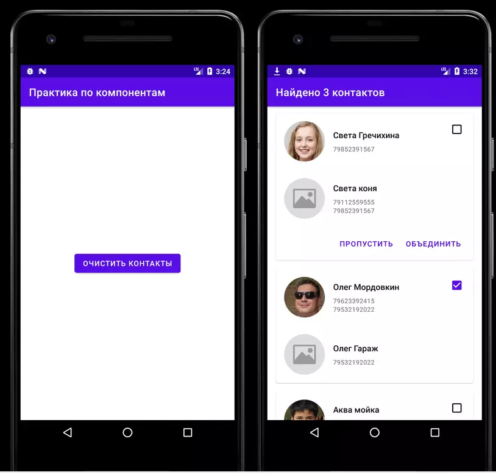

## В ветке `f/lifecycle` хранится реализация первого приложения из практической части лекции.

В нем находятся базовые реализации и обработка жизненного цикла активити

## В ветке `f/service` хранится реализация сервиса приложения из практической части лекции.

## В ветке `f/contacts` хранится реализация второго приложения из практической части лекции.

Для каждого класса имеется дополнительное описание.

## По всем вопросам можете писать в telgram в `Чат Surf Android  Summer School`. Также можете создавать issue в репозитории, где можете задавать ваши вопросы.

Приложение позволяет выбрать из телефонной книги контакты с одинаковыми номерами телефонов,
сгруппировать их и передать в виде
массива [Parcelable](https://developer.android.com/guide/components/activities/parcelables-and-bundles)
на следующий экран.

В ресурсах можете найти верстку [элементов](app/src/main/res/layout),
[строковые ресурсы](app/src/main/res/values/strings.xml) и
[размеры](app/src/main/res/values/dimens.xml).

В папке [data](app/src/main/java/ru/surfstudio/summerschool/app/data) хранятся модели, необходимые
для отображения элементов.

В [confirmation](app/src/main/java/ru/surfstudio/summerschool/ui/confirmation) хранится сам экран с
контактами.
В этом же пакете находятся адаптеры, необходимые для отображения элементов списка.

Подробнее можно почитать о
списках [здесь](https://developer.android.com/guide/topics/ui/layout/recyclerview)

# Важно

Посмотрите работу с [разрешениями](https://developer.android.com/guide/topics/permissions/overview)
и
обратите внимание
на [Activity Result API](https://developer.android.com/training/basics/intents/result).

В приложении работа с разрешениями реализована двумя методами, один из которых закомментирован.

В [MainActivity](app/src/main/java/ru/surfstudio/summerschool/ui/main/MainActivity.kt) по нажатию на
кнопку вызываем `ActivityCompat.requestPermissions`, а в методе `onRequestPermissionsResult`
результат разрешения обрабатывается

# Полезные ссылки

Информация вся на английском. Если нужна на русском, можно найти на habr'е переведенные или русские
статьи.

- [Курс от Google](https://developer.android.com/courses/android-basics-kotlin/course) для
  начинающих. Много практики и хорошей теории.
- [Создание первого приложения](https://developer.android.com/training/basics/firstapp)

## База

- [Основы](https://developer.android.com/guide/components/fundamentals)
- [Manifest](https://developer.android.com/guide/topics/manifest/manifest-intro)
- [Intent](https://developer.android.com/guide/components/intents-filters)
  и [статья](https://medium.com/@huseyinozkoc/all-things-you-need-to-know-about-intent-in-android-development-cb299b6b5918)
  на medium
- [Bundle и Parcelable](https://developer.android.com/guide/components/activities/parcelables-and-bundles) - передача данных между экранами
- [Статья](https://medium.com/droid-log/android-application-class-a8a1d64c82d1) про класс
  Application
- [Activity](https://developer.android.com/guide/components/activities/intro-activities)
- [Service](https://developer.android.com/guide/components/services)
- [Broadcasts](https://developer.android.com/guide/components/broadcasts)
- [Content Provider](https://developer.android.com/guide/topics/providers/content-providers)
- [Создание списков](https://developer.android.com/guide/topics/ui/layout/recyclerview)
- [Жизненный цикл Activity](https://developer.android.com/guide/components/activities/activity-lifecycle)
- [Шпаргалка](https://medium.com/androiddevelopers/the-android-lifecycle-cheat-sheet-part-i-single-activities-e49fd3d202ab)
  по жизненному циклу активити (что происходит при разных событиях экрана)

## Дополнительно

- [Версии Android и номера SDK](https://developer.android.com/studio/releases/platforms)
- [Библиотека](https://coil-kt.github.io/coil/) для загрузка изображений
- [Библиотеки](https://developer.android.com/kotlin/ktx) для упрощения работы с Android'ом
- [ViewModel](https://developer.android.com/topic/libraries/architecture/viewmodel) (здесь подробнее
  разбирается этот класс, но в рамках ЖЦ она упоминается в предыдущей ссылке)
- [Gradle](https://developer.android.com/studio/build)
- [WorkManger](https://developer.android.com/topic/libraries/architecture/workmanager)
